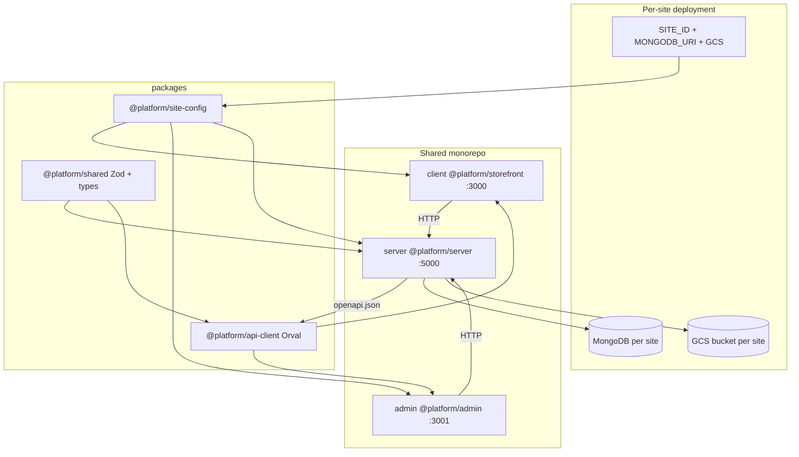
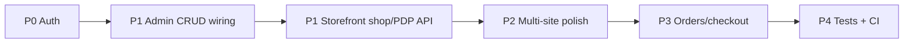

# Ecommerce Platform — Architecture, Features, and Gaps

## What this platform is

A **multipurpose ecommerce monorepo** designed to deploy **many storefront instances from one codebase**. Each site gets its own MongoDB database, GCS bucket, and env-driven config — but shares the same `client`, `admin`, `server`, and `packages/*` code.

**First live site:** Beauty Station (`beauty-station`) — cosmetics/skincare, home layout `cosmetic-beauty-two`.

**Honest maturity label:** The **platform skeleton is real** (shared contracts, multi-site config, catalog API, Orval client, CI typecheck). The **UI is largely a purchased theme** with **early API wiring** — catalog lists in admin and one home product block on the storefront hit the backend; everything else is static demo data or client-only Zustand state.

---

## Architecture (how it works)



### Layer breakdown

| Layer          | Location                                         | Role                                                     |
| -------------- | ------------------------------------------------ | -------------------------------------------------------- |
| Storefront     | [`client/`](client/)                             | Next.js App Router, Bootstrap 5 theme, ~300 demo routes  |
| Admin          | [`admin/`](admin/)                               | Next.js dashboard, Tailwind 4, ~40 pages                 |
| API            | [`server/`](server/)                             | Express 5 + Mongoose 9, catalog CRUD + uploads           |
| Shared schemas | [`packages/shared/`](packages/shared/)           | Zod validation + DTO shapes (OpenAPI source)             |
| Site registry  | [`packages/site-config/`](packages/site-config/) | `getSiteConfig(id)` — theme, features, URLs, home layout |
| API client     | [`packages/api-client/`](packages/api-client/)   | Orval-generated axios client from OpenAPI                |

### Multi-site resolution

Site identity is **never hardcoded in feature code** (except env defaults):

```ts
// Server: process.env.SITE_ID
// Client: getStorefrontSiteConfig() in client/lib/site.ts
// Admin: getAdminSiteConfig() in admin/lib/site.ts
const site = getSiteConfig(process.env.SITE_ID ?? "beauty-station");
```

New sites: `npm run create-site <id> -- --template beauty|sport|general` → add [`packages/site-config/src/sites/{id}.ts`](packages/site-config/src/sites/beauty-station.ts) → register in [`packages/site-config/src/index.ts`](packages/site-config/src/index.ts) → update [`docs/site-registry.json`](docs/site-registry.json).

### API contract pipeline

Single source of truth chain (well-designed for long-term maintenance):

1. Zod schemas in `packages/shared/src/schemas/`
2. OpenAPI registry in `server/src/openapi/registry.ts`
3. Committed `packages/api-client/openapi.json`
4. Orval → `packages/api-client/src/generated/`
5. Hand helpers in `packages/api-client/src/helpers.ts` (`fetchProducts`, etc.)

Dev apps auto-run `api:ensure` on start; CI runs `api:check` to reject stale contracts.

---

## Features — implemented vs template

### Server API (implemented)

| Area         | Status    | Endpoints                                         |
| ------------ | --------- | ------------------------------------------------- |
| Health       | Live      | `GET /api/health`                                 |
| Products     | Full CRUD | paginated list, text search, status filter        |
| Categories   | Full CRUD | paginated list                                    |
| Brands       | Full CRUD | paginated list                                    |
| Attributes   | Full CRUD | paginated list                                    |
| Uploads      | Partial   | `POST /api/uploads` → GCS (503 if not configured) |
| OpenAPI docs | Live      | `/api/docs`, `/api/openapi.json`                  |

**Models:** Product, Category, Brand, Attribute in [`server/src/models/`](server/src/models/). Seed via `npm run seed` ([`server/src/scripts/seed.ts`](server/src/scripts/seed.ts)).

**Not implemented on server:** auth, users, orders, cart, checkout, payments, wishlist API, reviews, blog, coupons, rate limiting.

### Admin dashboard

| Area                                                                   | API-connected | Notes                                                                                                 |
| ---------------------------------------------------------------------- | ------------- | ----------------------------------------------------------------------------------------------------- |
| Products list                                                          | Yes           | [`admin/app/(dashboard)/products/page.tsx`](<admin/app/(dashboard)/products/page.tsx>)                |
| Categories list                                                        | Yes           | same pattern                                                                                          |
| Brands list                                                            | Yes           | same pattern                                                                                          |
| Attributes list                                                        | Yes           | same pattern                                                                                          |
| All forms (new/edit)                                                   | No            | Submit buttons cosmetic; static defaults from `admin/data/`                                           |
| Delete in tables                                                       | No            | Local React state only                                                                                |
| Dashboard, orders, customers, coupons, roles, settings, reports, media | No            | Demo data in `admin/data/`                                                                            |
| Sign-in                                                                | No            | Link bypasses to dashboard ([`admin/app/(auth)/signin/page.tsx`](<admin/app/(auth)/signin/page.tsx>)) |

Navigation exposes the full ecommerce surface via [`admin/config/navigation.ts`](admin/config/navigation.ts) — **no feature-flag filtering** despite `SiteConfig.features` existing.

### Storefront

| Area                             | Status         | Notes                                                                                               |
| -------------------------------- | -------------- | --------------------------------------------------------------------------------------------------- |
| Production home `/`              | Partial API    | [`HomeLayoutRenderer`](client/components/site/HomeLayoutRenderer.tsx) → `cosmetic-beauty-two`       |
| Home products block              | API + fallback | [`Products1.tsx`](client/components/homes/home-cosmetic-beauty-two/Products1.tsx) only API consumer |
| Shop, PDP, blog, checkout routes | Static         | ~299 demo routes under `app/(homes)/`, `(shop)/`, etc.                                              |
| Cart / wishlist / compare        | Client-only    | Zustand + `localStorage` in [`client/context/store.ts`](client/context/store.ts)                    |
| Site theme                       | Partial        | CSS vars from `site.theme` in root layout; headers/logos still hardcoded                            |
| Site SEO                         | Yes            | Metadata from `site.seo` in [`client/app/page.tsx`](client/app/page.tsx)                            |

[`HomeLayoutRenderer`](client/components/site/HomeLayoutRenderer.tsx) maps **all** `HomeLayoutId` values to the same component today — `sport` and `general` templates are not differentiated yet.

---

## Advantages

1. **True multi-site from one repo** — env + site config + per-site DB/GCS; `create-site` CLI scaffolds env templates.
2. **Strong API contract discipline** — Zod → OpenAPI → Orval → typed client; CI enforces freshness (`api:check`).
3. **Clean package boundaries** — shared types, site config, and API client are separate workspaces with clear imports.
4. **Catalog API is functional** — real MongoDB CRUD with validation, pagination, search, denormalized category/brand names, product counts.
5. **Rich UI inventory** — admin forms and storefront theme provide polished UX to wire up rather than build from scratch.
6. **Good AI/dev documentation** — [`AGENTS.md`](AGENTS.md), [`docs/ARCHITECTURE.md`](docs/ARCHITECTURE.md), [`docs/ROUTES.md`](docs/ROUTES.md), Cursor rules for API contract and multi-site.
7. **Monorepo tooling** — root `typecheck`, `format`, `build:packages`, workspace `predev` hooks.

---

## Disadvantages / risks

1. **No authentication anywhere** — API, admin, and sign-in are open. **Unsafe for public deployment** without auth middleware + route protection.
2. **Massive demo surface** — ~300 storefront routes and ~40 admin pages create noise, bundle bloat risk, and confusion about what is “production.”
3. **Thin API integration** — 4 admin list pages + 1 storefront component; forms and deletes are fake.
4. **Client-only commerce state** — cart/wishlist/compare do not persist across devices or survive clearing browser data; no server-side cart or checkout.
5. **Feature flags unused** — `SiteConfig.features` and registry flags do not gate admin nav or storefront modules.
6. **Home layout registry is a stub** — all layout IDs render the same home component.
7. **Site branding not wired to headers** — [`Header13`](client/components/headers/Header13.tsx) uses hardcoded logo/phone; [`lib/brand.ts`](client/lib/brand.ts) is unused.
8. **No automated tests** — zero `describe(` / `.test.` files; CI does not run lint, Next builds, or tests.
9. **Node version mismatch** — root requires Node 20.x; [`client/Dockerfile`](client/Dockerfile) uses Node **24.13.0**.
10. **Data integrity gaps on server** — deleting categories/brands does not handle orphan products; attribute `productCount` never updated; seed wipes all data and ignores `SITE_ID`.
11. **GCS partial** — `deleteFile` / `getSignedReadUrl` exist but no routes; upload assumes public bucket URLs.
12. **Operational gaps** — no rate limiting, request logging, graceful Mongo disconnect on shutdown.

---

## Gaps to fix (prioritized)

### P0 — Security / deploy blockers

| Gap                          | Why it matters                          | Where                                                                   |
| ---------------------------- | --------------------------------------- | ----------------------------------------------------------------------- |
| **Auth on API + admin**      | All catalog CRUD and uploads are public | New `server/src/middleware/auth.ts`, admin `middleware.ts`, JWT/session |
| **Admin route protection**   | Dashboard accessible without login      | `admin/middleware.ts`                                                   |
| **Align Node in Dockerfile** | CI uses 20.x; Docker uses 24.x          | [`client/Dockerfile`](client/Dockerfile)                                |

### P1 — Core ecommerce path (Beauty Station MVP)

| Gap                                                   | Why it matters                            | Where                                                 |
| ----------------------------------------------------- | ----------------------------------------- | ----------------------------------------------------- |
| **Wire admin product/category/brand/attribute forms** | Cannot manage catalog from UI             | Form `onSubmit` → Orval `create*` / `update*` helpers |
| **Dynamic edit routes**                               | `/products/demo/edit` has no entity ID    | `admin/app/(dashboard)/products/[id]/edit/page.tsx`   |
| **Real delete actions**                               | Table delete is local-only                | Wire `removeProduct` etc. from api-client             |
| **Storefront shop + PDP from API**                    | Production paths still use `client/data/` | `/shop`, `/product/[slug]` with API fetch             |
| **Wire upload to product images**                     | GCS upload not linked to `product.images` | Admin form + server validation                        |

### P2 — Multi-site completeness

| Gap                                  | Why it matters                            | Where                                                                                     |
| ------------------------------------ | ----------------------------------------- | ----------------------------------------------------------------------------------------- |
| **Differentiate home layouts**       | `sport` / `general` templates meaningless | [`HomeLayoutRenderer`](client/components/site/HomeLayoutRenderer.tsx) + layout components |
| **Feature-flag nav filtering**       | Admin shows modules sites don't use       | [`admin/config/navigation.ts`](admin/config/navigation.ts)                                |
| **Site-aware seed**                  | Seed always Beauty Station data           | [`server/src/scripts/seed.ts`](server/src/scripts/seed.ts)                                |
| **Header/branding from site config** | Logos, contact, name hardcoded            | Headers + use `lib/brand.ts`                                                              |

### P3 — Commerce backend (roadmap)

Full roadmap in [`client/backend_features_analysis.md`](client/backend_features_analysis.md). Highest-value next domains:

- Cart + checkout session API
- Orders + payment integration
- User accounts + addresses
- Wishlist persistence (if not client-only)
- Reviews (Beauty Station has `features.reviews: true`)

### P4 — Quality and ops

| Gap                   | Action                                                                |
| --------------------- | --------------------------------------------------------------------- |
| No tests              | Add API route tests + critical mapper tests                           |
| CI scope              | Add `format:check`, admin `check`, client `lint`, optional Next build |
| Referential integrity | Cascade or block delete when products reference category/brand        |
| GCS delete route      | Expose delete + optional signed URLs for private buckets              |
| Graceful shutdown     | `disconnectDatabase()` in server `index.ts`                           |
| Demo route strategy   | Document which routes to keep vs exclude from production builds       |

---

## Recommended implementation order



For Beauty Station specifically, the **minimum viable product** is: auth → admin can create/edit/delete catalog → storefront shop and product pages read from API → checkout can remain client-demo until orders API exists.

---

## Key reference files

| Topic                 | File                                                                                                   |
| --------------------- | ------------------------------------------------------------------------------------------------------ |
| Platform architecture | [`docs/ARCHITECTURE.md`](docs/ARCHITECTURE.md)                                                         |
| Route inventory       | [`docs/ROUTES.md`](docs/ROUTES.md)                                                                     |
| API roadmap           | [`client/backend_features_analysis.md`](client/backend_features_analysis.md)                           |
| Site registry         | [`docs/site-registry.json`](docs/site-registry.json)                                                   |
| Beauty Station config | [`packages/site-config/src/sites/beauty-station.ts`](packages/site-config/src/sites/beauty-station.ts) |
| Production home       | [`client/app/page.tsx`](client/app/page.tsx)                                                           |
| CI                    | [`.github/workflows/ci.yml`](.github/workflows/ci.yml)                                                 |
